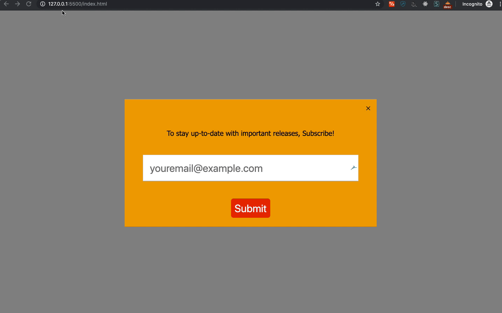

# Newsletter Subscription Overlay (Popup)

1. Create a form item or popup that requests a user to sign up for your newsletter.

1. Using the `MouseEvent.clientY`, write a function that triggers the _Newsletter Subscription Overlay_ when the user moves the mouse `< 10` pixels of the browsers **Y-axis**.

1. **Optional:** Style to your pleasing.

> Hint: Refer to the representation below and watch the mouse behaviour, for an idea of what your result should look like.

