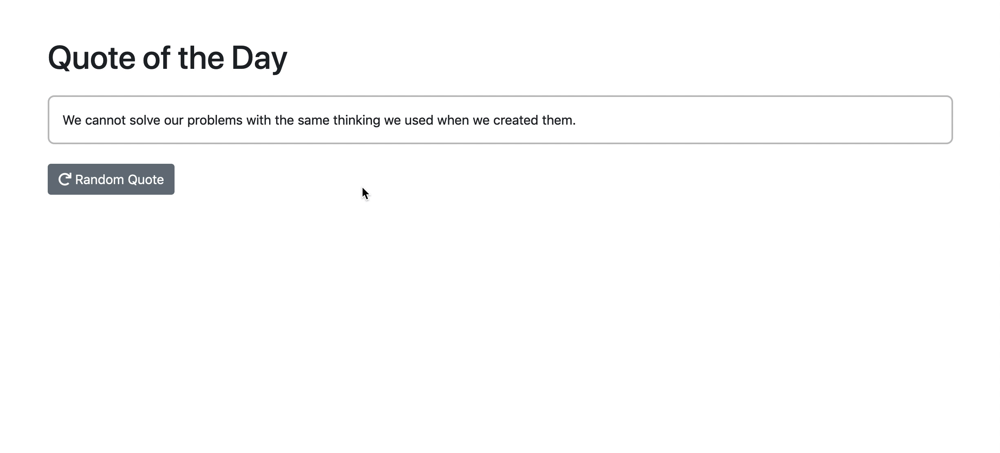

# Quote of the Day

Create random quote app, that shows a random quote when ever the user loads the App(page) or clicks the get random quote button.

1.  Create a function that returns a random quote from the array of
    quotes that's given. Remember that there's a nice function for
    random numbers in the MDN documentation for `Math.rand()`.

**Note:** _Sometimes it's a good idea to create multiple functions, that
do one specific thing only, to make the code more readable and
easier to maintain / extend._

2.  Add a Random Quote button beneath the quote element. When the button is clicked, a new quote should be generated.

3.  **Optional:** Style to your pleasing & feel free to load/use bootstrap via CDN.

> Hint: Refer to the representation below, for an idea of what your result should look like.

