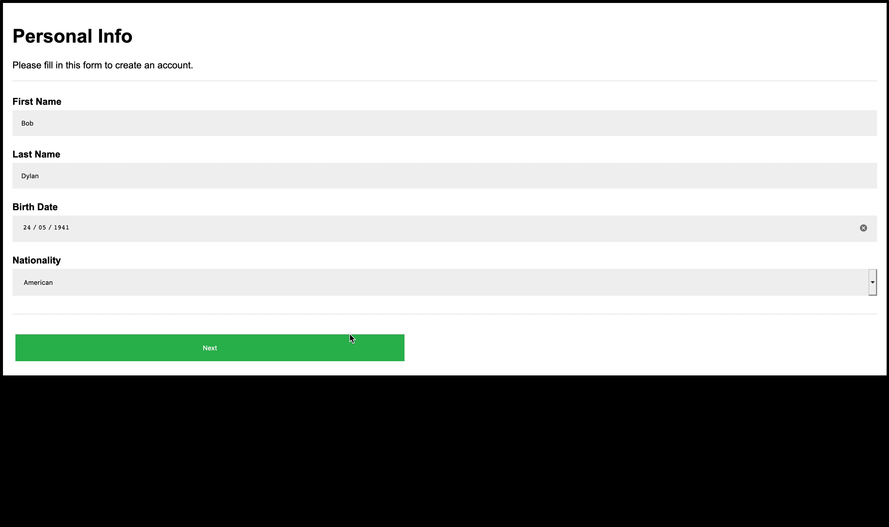

# Registration Form

Go through and use the existing form setup to create a 3 Phase/Part Registration that displays all user entries, as represented below. By default, the first form is shown and the rest are hidden.
The functionality of this registration form is as follows:
- Page one: the user is asked for personal information (first name, last name, date of birth, etc.).
- Page two: the user is asked for address information. 
- Page three: the user is asked for profile information (username, password and profile photo).


1. Using the `checkValidity()` method, write a function that checks if the requirement for every input field has been met. e.g

```javascript
let checkNationality = document
  .getElementsByName('nationality')[0]
  .checkValidity();
```

<br>

2. `alert()` the user if they haven't given valid input for all of the form's fields.

3. Upon completion, the next phase should be displayed and the previous hidden.

4. Write a function `showData()` that shows all user data upon successful completion of the form.

4. The user should be able to go back to the previous page to make changes.

> Hint: Refer to [MDN](https://developer.mozilla.org/en-US/ 'MDN Homepage')
> & the representation below, for an idea of what your result should look like.


