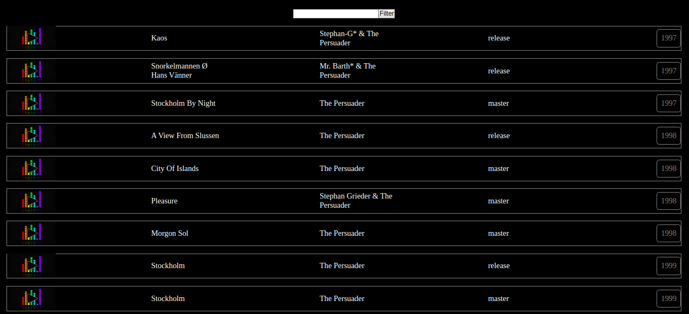

## Instructions for students:

### The Sound of Silence 
For each entry you should show:
- track name or title 
- artist name
- type
- release date

Good to know:
-   Make sure the program has an `index.js` file and any other files required.
-   Make sure to use `Fetch`.
-   Make sure to get your own `API KEY`.
-   or try free API "https://www.discogs.com/developers"

-   After you have executed your program you should be able to see the following output:

**Bonuses**

-   Your program should be able to display the 5 day forecast.

-   Your program should be able to display the degrees also in Fahrenheit.

### Rules

-   This is an individual assignment.
-   Deadline: 2 hours.
-   Use **Git properly**

This is how it looks in iTunes but you are free for the design part.

