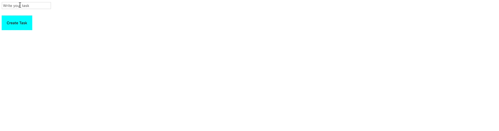

# To-Do List App

### Description:
- Through this To-Do List App, the user should be able to add items to the todo list. 
- There's an input field where the items are added. 
- The user can also delete these items through a button.

1. Create a TO-DO List app with an input field and button for adding To-Do's. On **Submit** or **Button-click**, a To-Do should be added to the list of To-Do's.

2. Add a _Delete_ button in the form of **X**, to enable the user delete a To-Do from the list.

3. **Optional:** Style to your pleasing.

## Bonus
- Add a button to show that the item is complete. 
- You can add styling to cross-out an item.

> Hint: Refer to the representation below, for an idea of what your result should look like.

