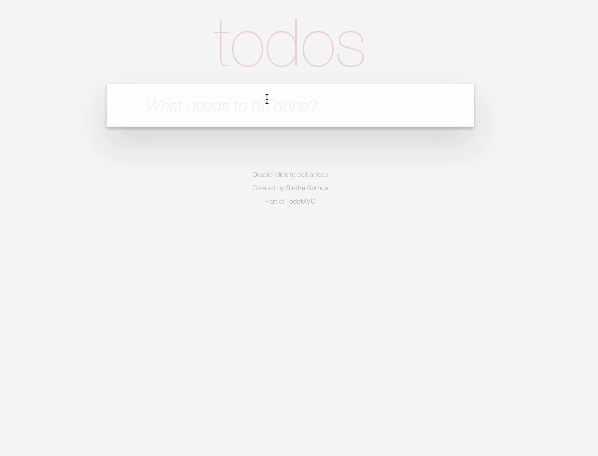

# TodoMVC App

The following ToDo List app has been created with JQuery and Handlebars, however due compatibility and performance issues;

1. Convert/Change the JQuery syntax in the `app.js` file to JavaScript(ES6+).

_Note:_ The converted code should still work with handlebars.

**Insight:** The `bind()` method enables you keep the context of `this` within another function.

> Hint: Refer to the representation below, for an idea of what your result should look like.

