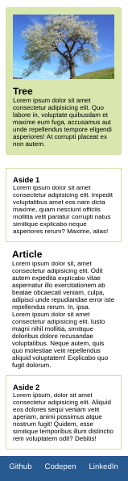

# Sassy Website

Create a mockup website as seen in the [reference image folder](./images_reference). 

**Instructions**: 

* Use sass to create the mockup. 
* Make use of nesting and variables where possible.
* Make sure to design for mobile first! 
* Breakpoints:
    - 768px - tablet 
    - 1024px - desktop
* Colors for styling: 
    - Card background color: #e0ddb2
    - Card and aside borders: #dad6ab
    - Color used for nav and footer: #016690
* Use the images in the [images folder](./src/images) for the header and cards.

