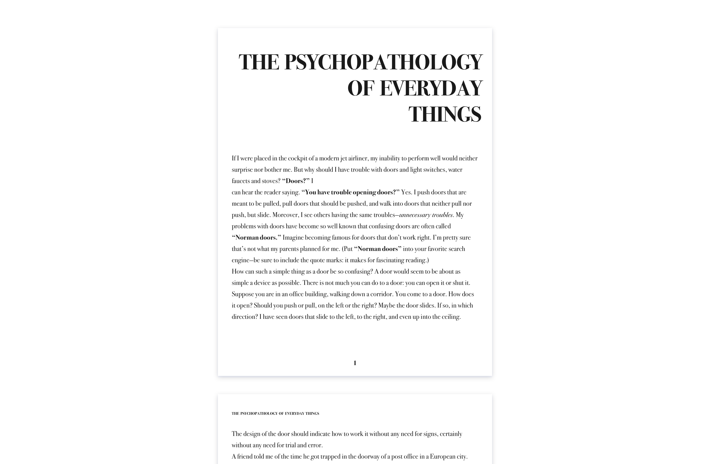

# Information Page

**Instructions**:

Use the text in the [text.md](./text.md) to create an informative website. 

**Rules**: 
* Make sure to use semantic tags. In the markdown, page breaks are shown with `---`.
(You will need to read the text in order to markup it correctly.)
* Use the font Arapey.
* Create a website following the design of the image below.
* The menu should direct the user to the corresponding page in the journal.

